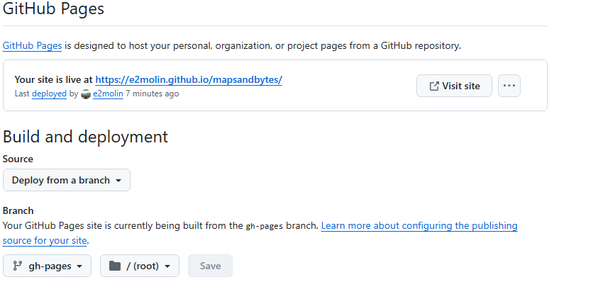

# Blog Maps & Bytes

Este website se ha montado usando [Docusaurus](https://docusaurus.io/)

### 🔶 Clonamos - *Cloning*

```
$ git clone https://github.com/e2molin/mapsandbytes
```


### 🔶 Instalación - *Installation*

```
$ npm install
```

### 🔶 Servidor de desarrollo - *Local Development*

```
$ npm run start
```

This command starts a local development server and opens up a browser window. Most changes are reflected live without having to restart the server.

### 🔶 Distribución - *Build*

```
$ npm run build
```

Este comando genera contenido estático en el directorio `build` y puede destribuirse usando un *static contents hosting service*.

### 🔶 Despliegue en Github Pages - *Deployment on Github Pages*

Para publicar en GitHub Pages tenemos que tener el proyecto público. Esto es fundamental.

Seguidamente en la pestaña de **Settings** de nuestro proyecto, vamos al apartado `Pages`, donde tenemos que configurar varias cosas:

* En la sección `Build and deployment` tenemos que elegir la opción Deploy from a branch
* Un poco más abajo en branch seleccionamos la opción de publicar desde la rama `gh-pages`



Si la primera vez que lo hacemos todavía no tenemos creada la rama `gh-pages`, podemos lanzar el comando en Powershell

```bash
cmd /C 'set "GIT_USER=e2molin" && set CURRENT_BRANCH=main && set USE_SSH=true && npm run deploy'
```

Esto creará una rama llamada `gh-pages` donde se desplegará nuestra website. Una vez hecha la primera vez, siempre que querramos actualizar, los procesos serán

* Comprobar que todo funciona en local. Para eso es útil:
  * Probamos que en desarrollo va bien
  * Hacemos una `build' para comprobar que todo se desplegaría bien en local.
    * De esta manera se comprueba que todos los links internos se satisfacen
    * Podemos desplegar la carpeta `build` ejecutando `npm run serve`
* Hacer un `commit` de los cambios al repo local
* Hacer un `push` de los cambios al repo remoto

Hasta ahora sólo hemos subido los datos al repo de GITHUB. No hemos desplegado dedsde la rama 🌳 `gh-pages`. Para ello se supone que el comando `npm run deploy` debería hacerlo, pero amí no me sale así. Tengo que ejecutar todo esto otra vez

```bash
cmd /C 'set "GIT_USER=e2molin" && set CURRENT_BRANCH=main && set USE_SSH=true && npm run deploy'
```

en donde le paso como parámetros mi usuario de **github**, la rama `main` desde donde se hace el despliegue, y al final va el comando que decía antes, `npm run deploy`. Entonces veremos que todo se depliega. Podemos ver cómo va el proceso desde:

> 🔗 [https://github.com/e2molin/mapsandbytes/actions](https://github.com/e2molin/mapsandbytes/actions)

compruebo cómo va la ejecución del las GitHub Actions. Una vez terminadas (las primeras veces tardaba entorno a 33 segundos) podremos ver la web desplegada en:

> 🔗 [https://e2molin.github.io/mapsandbytes](https://e2molin.github.io/mapsandbytes)

> OJO, para desplegar no basta con hacer un commit & push, tenemos 


### ⛲ Fuentes

* Create & Deploy Your Website Quickly - Docusaurus & GitHub Pages [🔗 Enlace](https://www.youtube.com/watch?v=9iVNf0T09dE)
* Portafolios & Videos de Federico Tartarini [🔗 Enlace](https://federicotartarini.github.io/)
* Portafolios montado con Docusaurios
  * Ron Amosa  [🔗 Enlace](https://ronamosa.io/)
  * Luis Llamas [🔗 Enlace](https://www.luisllamas.es/)

Ver

https://github.com/mysticatea/cpx

https://github.com/calvinmetcalf/copyfiles

https://stackoverflow.com/questions/38026117/
how-to-use-package-json-scripts-to-copy-files-with-specific-file-extension

---

Esta web está construida utilizando  [Docusaurus](https://docusaurus.io/).
