import BeautyTag from '@site/src/components/BeautyTag';
import Tabs from '@theme/Tabs';
import TabItem from '@theme/TabItem';
import rutaNarbone01 from "./image/ruta-narbonne-01.jpg";
import rutaNarbone02 from "./image/ruta-narbonne-02.jpg";
import imgAvignon from "./image/avignon.jpg";
import imgPontDuGard from "./image/pont-du-gard.jpg";
import imgAnnecy from "./image/annecy.jpg";
import imgAnnecyLago from "./image/annecy-lago.jpg";
import imgAguilleMidi from "./image/aguille-midi.jpg";
import imgGinebraReloj from "./image/ginebra-reloj.jpg";
import imgPlageLutry from "./image/plage-lutry.jpg";
import imgMontreaux from "./image/montreaux.jpg";
import imgInterlakenBerna from "./image/interlakern-por-berna.jpg";
import imgInterlakenZermatt from "./image/interlakern-por-zermatt.jpg";
import imgberna from "./image/berna.jpg";
import imgThunersee from "./image/thunersee.jpg";
import imgZermatt from "./image/zermatt.jpg";
import imgMatterhorn from "./image/matterhorn.jpg";
import imgSion from "./image/sion.jpg";
import imgInterlakenAar from "./image/interlaken-aar.jpg";
import imgLauterBunner from "./image/lauterbrunnen.webp";
import imgGrindeWald from "./image/grindewald.jpg";
import imgFurkaPass from "./image/furka-pass.jpg";
import imgLucerna from "./image/lucerna.jpg";
import imgRheinfall from "./image/cataratas-del-rin-rheinfall.webp";
import imgRutaPorLucerna from "./image/interlaken-locarno-por-lucerna.png";
import imgRutaPorFurkaPass from "./image/interlaken-locarno-por-furkapass.png";
import imgPresa from "./image/presa-verxasca.jpg";
import imgMaggiore from "./image/maggiore.jpg";

<svg xmlns="http://www.w3.org/2000/svg" viewBox="0 0 1440 320"><path fill="#364b5f" fill-opacity="0.75" d="M0,192L80,170.7C160,149,320,107,480,122.7C640,139,800,213,960,224C1120,235,1280,181,1360,154.7L1440,128L1440,0L1360,0C1280,0,1120,0,960,0C800,0,640,0,480,0C320,0,160,0,80,0L0,0Z"></path></svg>

## 🥝 Saliendo.

Cada vez que voy a Francia, disfruto saliendo de Madrid por la Radial 2, ahorrándome tráfico, rádares y saliendo más allá de Guadalajara. Hasta llegar a Zaragoza hay pocas alternativas, pero desde aquí y hasta **Narbonna**, en función de la opción que elijáis, el viaje empieza a cambiar.

* Google Maps y el GPS aconsejan una ruta de `5h. 30 min`. Pasas por Barcelona, cinturones litorales, AP-7 hasta la Junquera y luego Narbona. Es la ruta habitual que hoy en día no tiene peajes hasta la Jonquera. Pero tiene muy poco que ver, calor, atascos, y pasar la frontera a Francia donde siempre hay atasco salvo que lo hagáis de noche. Una opción para evitarlo es aprovechar y darse un chapuzón en la playa (nosotros lo hicimos en Sant Feliu) hasta las 9, 10 de la noche y luego cruzar de noche la frontrera, durmiendo en un hotel pasado Narbona. pero reconozco que salir de la autopista y acercarse al litoral, es cansado y hay carreteras con mucho atasco de turista playero. 
* La otra opción y que os recomiendo es entrar en Francia por el túnel de Bielsa y el valle de **Saint Lary**. Según Google Maps son 45 minutos más, pero a mí me merece la pena.  Desde Zaragoza hacia Huesca no hay atasco. Desde Huesca podéis ir por Sabiñánigo, Fiscal y Boltaña hasta Ainsa, que es una ruta de montaña, aunque aquí la carretera sí es un poco estrecha, pero muy bonita entre cañones y cortados. Otra opción desde Huesca es ir por Barbastro, El Grado y subir hasta Ainsa tambié. Por aquí la carretera es mucho mejor, incluso con tramos de autovía, bordeando embalses, con sitios para parar y comer. Sólo unos kilómetros más larga que desde Sabiñánigo.

<section class="center-lanscape-section">
  <figure class="img-duo">
    
    <figcaption>Ruta por Barcelona 🚗[Enlace itinerario](https://maps.app.goo.gl/oDDFC1vBGLpxrZXdA)</figcaption>
  </figure>
  <figure class="img-duo">
    
    <figcaption>Ruta por Toulose 🚗[Enlace itinerario](https://maps.app.goo.gl/54gXp1qbEZBiqDEj9) </figcaption>
  </figure>
</section>

Desde **Ainsa**, subís a Bielsa y pasáis el túnel, entrando en Francia. No hay controles, apenas atasco, y entráis a este valle francés por el que bajais haciá Saint Lary y Arreau. Buena carretera y paisaje espectacular. Incluso he ido de noche y con lluvia y se va bien. Desde Arreau subís a la autopista y desde allí a Narbona. La circunvalación de Toulouse es fácil, podéis aprovechar a verla o dejarlo para la vuelta. Algo más largo, en tiempo 45 min. a 1 hora más que por Barcelona, pero recomendable. Además, las gasolineras son más baratas (en Francia se nota) y podéis parar en cualquier pueblo a comer / descansar.

## 🥝 Desde Narbona a Grenoble

Son unos 400 Km/ 4 horas. **Nimes** está bien para ver, con su anfiteatro (Arlés es mejor), pero creo que os pilla mejor a la vuelta. Aunque yo os propondría desviaros unos 20/30 Km y paraba a comer / dormir o lo que os toque en **Avignon**. 

<section class="center-lanscape-section">
  <figure class="img-single">
    
    <figcaption>Avignon</figcaption>
  </figure>
</section>

Medieval, muy recomendable. Se aparca el coche en las afueras 🔗[en este parking](https://maps.app.goo.gl/QXCAh4ofhdbiDgZTA) y se sube paseando a la ciudad de los Papas. Muy bonita. Igual el desvío os parece mucho, pero os aviso que más o menos por esta zona se conectan la autoposta de la costa azul, que os llevaría a MArseilla, y la que sube a Lyon, que tendreís que coger para desciaros después a Grenoble. Y es zona de atascos a cualquier hora del día. Problemático. Así que según veais cómno está el tráfico, pasar un rato en Avignon compensa. 

También os pilla de paso el **Pont du Gard**, pero al igual que Arlés podéis hacer a la vuelta. Recomendable. Se puede bañar en el río a los pies del monumento. También hay sitio para comer. Mejor 🚗[este parking para acceder](https://maps.app.goo.gl/PidpP5dQSNMRwk8L8) directamente al monumento si vais con poco tiempo. Accedeis por abajo desde el río y enseguida tenéis restaurante y vistas. Si tenéis más tiempo 🚗[iros a este otro](https://maps.app.goo.gl/7dSttNRPtGb9SA536) porque en su entrada hay infografías, tiendas y accedéis desde arriba al puente (no hay que subir y lo cruzáis). Hay que pagar sólo el parking, ni se os ocurra dejar el coche en descampados, no merece la pena, y ponen multas.

<section class="center-lanscape-section">
  <figure class="img-single">
    
    <figcaption>Pont du Gard</figcaption>
  </figure>
</section>

## 🥝 Desde Grenoble a Ginebra

Son unos 140 Km/ 1hora y tres cuartos. Un sitio espectacular de camino es **Annecy**, a orillas del lago. Es una ciudad con canales, por la que perderse es aconsejable. Luego tiene un parque a orillas del lago que está muy bien para tirarse en el césped y meter los pies en el agua. 🚗[Este parking](https://maps.app.goo.gl/pPSaJKeP9dp3n4ag7). Pero si está lleno y tenéis que ir 🚗[hasta este otro](https://maps.app.goo.gl/tsjtoCCa9UP1aCox9), merece la pena el paseo por la orilla. 

<section class="center-lanscape-section">
  <figure class="img-single">
    
    <figcaption>Annecy. Canal principal</figcaption>
  </figure>
</section>

<section class="center-lanscape-section">
  <figure class="img-single">
    
    <figcaption>Annecy. Lago</figcaption>
  </figure>
</section>

No sé cómo os pillará, de mañana, de tarde, para pasar la noche... Si es esta última, no os quedéis en Annecy. Es caro, mucho mejor dormir en este pueblo cerquita, **Thones**. [Este hotel](https://maps.app.goo.gl/2A7hpFKnJ2d3xS7e8) es pequeño, de carretera, pero suele estar bien de precio y disponible. Y por la mañana tendréis un sitio para desayunar a buen precio.

Si desde Annecy queréis ir a Chamonix, son 100 Km/1h y media. Lo mejor en Chamonix es dejar el coche 🚗[en este parking](https://maps.app.goo.gl/GtRU8y3b4TUHTkrq5) y recorrer andando la ciudad. Aquí lo mejor es subir en teleférico al **Aiguille du Midi** y pasar el día disfrutando de las montañas. Arriba se puede comer, pasear y disfrutar de las vistas. Está todo conectado con plataformas, algunas de ellas con el suelo de cristal para comprobar si tienes vértigo.

<section class="center-lanscape-section">
  <figure class="img-single">
    
    <figcaption>Cima del Aguille de Midi</figcaption>
  </figure>
</section>

A lo mejor es mejor comer abajo al volver, que tampoco será barato, pero a igual precio se come mejor. Hay calle peatonal con un montón de mrcas de ski. Nosotros 🍽️[comimos aquí](https://maps.app.goo.gl/VxTwqPBn3c9rWoSi9) unas tortillas 🍳 espectaculares en la terracita al sol👓.

## 🥝 Ginebra

Cuando lleguéis a Suiza, preparaos a pagar por cualquier cosa. Los precios están inflados en todo, pero eso sí, todo es muy bonito. **Ginebra** no es que sea una ciudad espectacular. Lo mejor el geiser y el paseo por el parque junto al lago, el Jardín inglés.

<section class="center-lanscape-section">
  <figure class="img-single">
    
    <figcaption>Reloj floral en Jardin des Anglais</figcaption>
  </figure>
</section>

Aparcar junto al géiser es complicado, recuerdo que no había sitio. Mejor ir andando.

## 🥝 Lac Leman.

La autopista bordea todo el Lago Leman, desde Ginebra a Vevey. Si os apetece meter los pies y daros un chapuzón, hay algunas playas que están bien. Esta es la [Plage de Lutry](https://maps.app.goo.gl/fcxAQPUAAB41dJG39). Chiringuito para comer algo y zona de césped para tumbarse y acceso al agua. El coche lo aparcáis [en este supermercado](https://maps.app.goo.gl/Uo2TjvHsj5Zow8Ex5), y aprovecháis para comprar si necesitáis algo. Si os pilla bien, el baño con las montañas de fonde merece la pena, y hay trampolines.

<section class="center-lanscape-section">
  <figure class="img-single">
    
    <figcaption>Plage de Lutry cerca de Lausane 📍[Situación](https://maps.app.goo.gl/fcxAQPUAAB41dJG39)</figcaption>
  </figure>
</section>

Desde **Vevey** podeís ir hacia **Berna** o hacia **Montraux**. Una opción es dormir en **Montraux** un par de noches. Llegais un día y descansáis y aprovechaís para ver la ciudad, el **Château de Chillon** y tomar una fondeau junto al puerto.

<section class="center-lanscape-section">
  <figure class="img-single">
    
    <figcaption>Château de Chillon cerca de Montreaux 📍[Situación](https://maps.app.goo.gl/w8gLxGeGfXyqa6BY9)</figcaption>
  </figure>
</section>

## 🥝 Cómo llegar a Interlaken

Podeís ir a Interlaken desde el sur por el Matterhorn (bonito pero carreteras más estrechas) o desde el norte pasando por Berna (autopistas y carreteras junto al lago) No es excluyente, pero hay que decidir qué hacer primero. De Montreaux a Zermatt son 139 km, unas dos horas por carreteras alpinas. Desde Montreaux llegais a **Berna** a 90 Km en una hora.

<section class="center-lanscape-section">
  <figure class="img-duo">
    
    <figcaption>Interlaken por Berna 🚗[Itinerario](https://maps.app.goo.gl/Rpe9EjWA5PoxqPec9)</figcaption>
  </figure>
  <figure class="img-duo">
    
    <figcaption>Interlaken por Sion y Zermatt 🚗[Itinerario](https://maps.app.goo.gl/8ajYTY8ACM9kUATw8) </figcaption>
  </figure>
</section>

Según lo que hagais, podéis ir primero a Berna y volver a Montreaux a dormir y luego ir a Interlaken viendo de paso el Matterhorn. O podéis ir a ver el Matterhorn y Sion, volver a Montreaux a dormir, y al día siguiente vais a Interlaken pasando por Berna. Lo que os pida el cuerpo. Quizás la opción de Interlaken por Berna es la menos cansada.

## 🥝 Berna

Desde Montreaux llegais a **Berna** a 90 Km en una hora. Berna es la capital. Para dejar el coche, os recomiendo [este parking junto al casino](https://maps.app.goo.gl/VebjE2jRLEyjBgZq6). Berna está rodeada por el río Aar. Tranvías y se puede recorre a pie, en especial su calle principal **Gerechtigkeitsgasse**. Fuentes, relojes astronómicos parecidos al de Praga, una ciudad de aspecto medieval interesante

<section class="center-lanscape-section">
  <figure class="img-single">
    
    <figcaption>Berna y reloj astronómico</figcaption>
  </figure>
</section>

Berna da para una mañana, no para todo un día. Si habéis elegido la opción de ir a Interlaken por Berna, bordeareís los ñlagos entre los que está la ciudad y pasareis por **Oberhofen am Thunersee**  👇

<section class="center-lanscape-section">
  <figure class="img-single">
    
    <figcaption>Thunersee</figcaption>
  </figure>
</section>

## 🥝 Matterhorn y Sion

 Al día siguiente podeis ver la zona de Sion y **Zermatt** para subir al **Matterhorn**. De Montreaux a Zermatt son 139 km, unas dos horas por carreteras alpinas. Realmente el coche lo dejaís en **Täsch**, donde se coge un tren que te sube a Zermatt. Hay un gran parking y está todo preparado para que dejes el coche y subas al ski resort. Zermatt es un pueblo de postal a los pies del **Matterhorn**, que es el monte del toblerone.
 

<section class="center-lanscape-section">
  <figure class="img-single">
    
    <figcaption>Zermatt</figcaption>
  </figure>
</section>

 
Desde aquí cogéis uno de los multiples teleféricos y... al cielo!,  para ver de cerca del monte. Hay ontnoes de combinaciones e itinerarios, elegis el más barato / que os guste/ os sea sencillo de andar. Y mediante unos teleféricos 🚠 del tamaño de autobuses de la EMT os llevan hasta arriba.

<section class="center-lanscape-section">
  <figure class="img-single">
    
    <figcaption>Matterhorn o Monte Cervino</figcaption>
  </figure>
</section>

Podéis cenar/merendar en **Zermatt**, pero yo aguantaría la vuelta a Montreaux y pararía en **Sion**, que tiene un castillo estilo Guillermo Tell 🏹. Aquí una cena está más cerca de Montraux y será más barata.

<section class="center-lanscape-section">
  <figure class="img-single">
    
    <figcaption>Castillo de Sion</figcaption>
  </figure>
</section>

Otra opción es no volver a Montraux e ir por carreteras hacia Interlaken. Paisajes espectaculares, pero carreteras reviradas y os perderéis Berna, que tiene su interés. Yo volvería por Montreaux y visitar Berna antes de Interlaken.

## 🥝 Interlaken

De una manera u otra llegais a **Interlaken**. Se encuentra entre el lago de Thun al oeste y el lago de Brienz al este, mientras que el río Aar, el mismo que pasapor Berna, atraviesa la ciudad. En esta ciudad sólo estuve de paso camino de Lucerna. Lo mejor es hacer rutas por los alrededores. Dependiendo del tiempo que paséis, en las oficinas de turismo seguro que aconsejan unas u otras rutas.

<section class="center-lanscape-section">
  <figure class="img-single">
    
    <figcaption>Interlaken. Puente sobre el Aar</figcaption>
  </figure>
</section>

### 🍊 Excursiones desde Interlaken

Podéis subir a **Lauterbrunnen** 👇 que está a media hora o a **Grindelwal**, donde creo se puede subir en tren. Aquí es donde están rodadas las imágenes iniciales de Sonrisas y Lágrimas.

<section class="center-lanscape-section">
  <figure class="img-single">
    
    <figcaption>LauterBurnner</figcaption>
  </figure>
</section>

<section class="center-lanscape-section">
  <figure class="img-single">
    
    <figcaption>Grindewald</figcaption>
  </figure>
</section>

También a una hora está el Puerto de Furka o **Furka Pass**, donde hay un hotel, ya abandonado pero icónico, donde se rodaron planos de James Bond en Goldfinger. Icónico es la palabra.

<section class="center-lanscape-section">
  <figure class="img-single">
    
    <figcaption>Paso de Furka. Hotel Belvedere</figcaption>
  </figure>
</section>

### 🍊 Excursión a Lucerna

La ciudad de **Lucerna** está cerca, a unos 70 Km, una hora. Lo más bonito que tiene son unos puentes de madera patrimonio de la humanidad, muy bonitos, pero tampoco más. Eso sí, son muy fotogénicos.

<section class="center-lanscape-section">
  <figure class="img-single">
    
    <figcaption>Lucerna. Kapellbrücke</figcaption>
  </figure>
</section>

### 🍊 Ir o no ir a Zurich

Zurich está de Interlaken a 120 Km, unas 2 horas. Eso sí, tiene un tráfico de mil diablos, y las circinvalaciones son una trampa. Además, si vais a Italia se sale de ruta, ya que luego tendríais que volver. ¿Merece la pena? Bueno, es una ciudad ideal para ver coches caros y escaparates con muchos ceros en los precios, pero no es nada del otro mundo. Para mí solo tiene sentido si después subis más arriba, hasta las cataratas del Rhin, **Rheinfall** 👇, en la frontera con Alemania, que sí merecen mucho la pena, aunque están a una hora más de coche. Pero Zurich, suene mucho, pero a mí no me llamó para nada la atención. Casi diría, si tenéis ganas, id hasta las cataratas, pero pasad de Zurich.

<section class="center-lanscape-section">
  <figure class="img-single">
    
    <figcaption>Cataratas sobre el Rhin. Rheinfall</figcaption>
  </figure>
</section>

---

## 🥝 Hacia Italia.

Desde Suiza a Italia se puede ir por varios caminos. Google os llevará por autopista que viene desde Zurich y Alemania, el lago de Lugano, pero yo entraría a Italia por Locarno. Locarno está situada al norte del lago Maggiore, el más grande y quizás el menos visitado de los lagos alpinos italianos. Pero tiene mucho más encanto. Los lagos de Como o Garda, para disfrutarlos, hay que verlos desde un barco. Maggiore sin embargo, puedes visitarlo y recorrerlo bien por la carretera que lo bordea oor su orilla occidental.

🔗[Esta ruta](https://maps.app.goo.gl/EaUpZe9SvkahCScG8)  os lleva pasando cerca de **Lucerna**, por si los días anteriores no la habéis visto o la reservais para verla ahora. Es la más rápida y corta.

<section class="center-lanscape-section">
  <figure class="img-single">
    
    <figcaption>Ruta por Lucerna. 🚗[Itinerario](https://maps.app.goo.gl/EaUpZe9SvkahCScG8) </figcaption>
  </figure>
</section>

Sin embargo 👇 esta 🔗[es la ruta](https://maps.app.goo.gl/wobPsrjY6u1rVoMd9) que yo haría ❤️, pasando por **Furka Pass**, igualmente si no lo habéis visto en días anteriores. Ojo, hay que hacerla de día, porque tiene muchas curvas. Estas carreteras salen en la película de *«Un trabajo en Italia»* de **Michael Caine**, la de los *«minis»* que asaltan un furgón blindado 💰 en Torino, y ya que posiblemente vayáis luego a Torino, os recomiendo ver antes de iros.

<section class="center-lanscape-section">
  <figure class="img-single">
    
    <figcaption>Ruta por el Paso Furka. 🚗[Itinerario](https://maps.app.goo.gl/wobPsrjY6u1rVoMd9) </figcaption>
  </figure>
</section>

En ambos casos casos, antes de llegar a Locarno, otro snapshot peliculero, esta vez la presa desde donde **Pierce Brosnan** salta atado por los pies en 📽️[Goldeneye](https://www.filmaffinity.com/es/film678897.html), la *«diga di Contra»* o la Represa de Verzasca 📍[Posición](https://maps.app.goo.gl/Nj7E6bRwoKpCuXPw7).

<section class="center-lanscape-section">
  <figure class="img-single">
    
    <figcaption>Represa de Verzasca. 📍[Posición](https://maps.app.goo.gl/Nj7E6bRwoKpCuXPw7) </figcaption>
  </figure>
</section>

## 🥝 Lago Maggiore.

Maggiore invita a recorrerlo en un descapotable con la música de Rita Pavone escuchando *«Viva la pappa col 🍅 pomodoro»*  🎵🎶[Música](https://open.spotify.com/intl-es/album/6FXSdnTDjoh5P4ipcbkPkp?si=r2EkekU3SX6oinkMonyDqA). Maggiore está conectado con otros lagos más pequeños como **Mergozzo**, donde puedes encontrar playas de césped junto al agua. Bañarse en un lago alpino con el calor del verano es una experiencia.

<section class="center-lanscape-section">
  <figure class="img-single">
    
    <figcaption> Lago Maggiore</figcaption>
  </figure>
</section>

Desde Locarno a Baveno [son apenas 50 Km](https://maps.app.goo.gl/XmWfEFkRyuVWLcGs5), pero se puede ir parando y hacerlo a lo largo de un día, una mañana, o el tiempo que tengais. Camino de Baveno podéis comer en cualquiera de los pueblos por los que pasais. Yo recomiendo Canobbio 📍[Posición](https://maps.app.goo.gl/CsHWrjwKRyBQsDid9), alguna de sus trattorias junto al lago. 

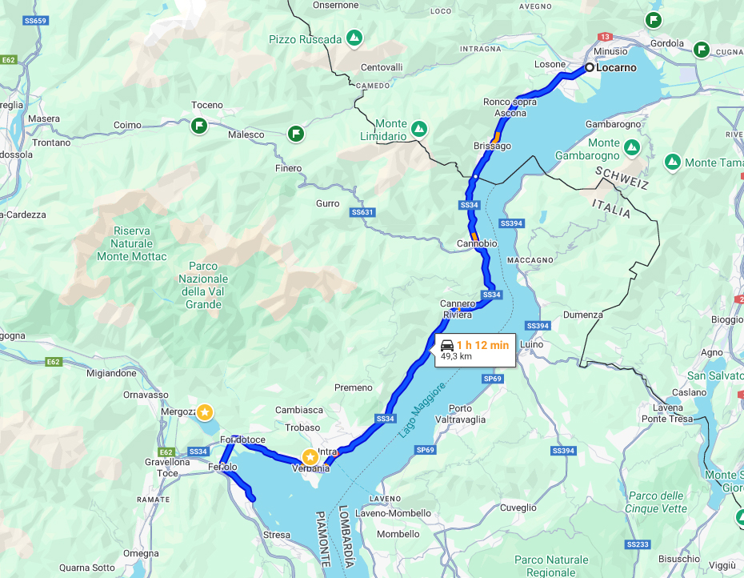

Verbania es una de las localidades más importantes, y pasear junto al lago apetece de mañana, tarde y noche.

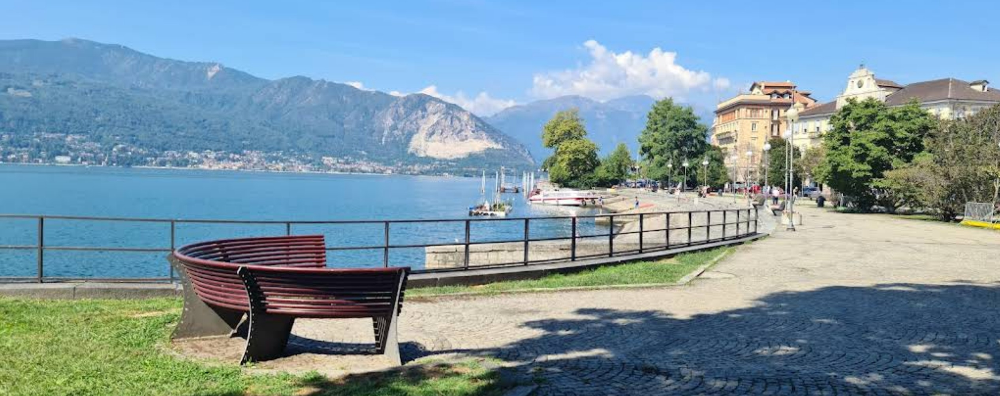

Para dormir, cualquier localidad está bien. Quizás cuanto más al sur ya alejado de Suiza, más barato. Baveno y Stressa están bien. De todas estas localidades costeras salen ferris para conocer las *«dísolas»* del lago, recomendable cogerlos barcos en Baveno. Los ferris hacen rutas circulares en plan autobús. Coges uno, bajas en una isla, la visitas, y cuando terminas esperas al siguiente. Las rutas son circulares y siempre puedes volver al sitio del que saliste. Las islas son *«Isola dei Pescatori»* e *«Isola Bella»*. Yo os recomiendo el de Baveno, menos gente, parking al lado 📍[Posición](https://maps.app.goo.gl/sVkZdeUsM2Bh9aETA).

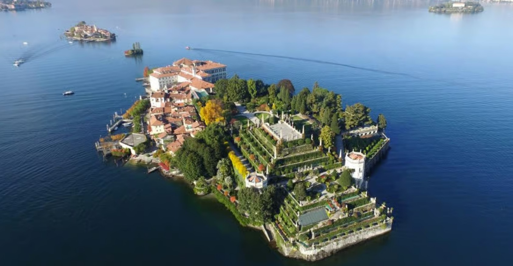

La localidad de **Arona** es la más importante y más al sur del lago Maggiore, conveniente visitarla al final o para pasar la última noche antes de seguir camino. Aquí os recomiendo el restaurante Barcaiolo Restaurant 📍[posición](https://maps.app.goo.gl/emKUArtwLMqJ1K8A8) para cenar una pasta y un pescado de calidad. La plaza porticada1 donde está este restaurante durante la puesta del sol es fantástica. Si no se puede cenar, sentarse en la orilla a tomar un gelato 🍨.

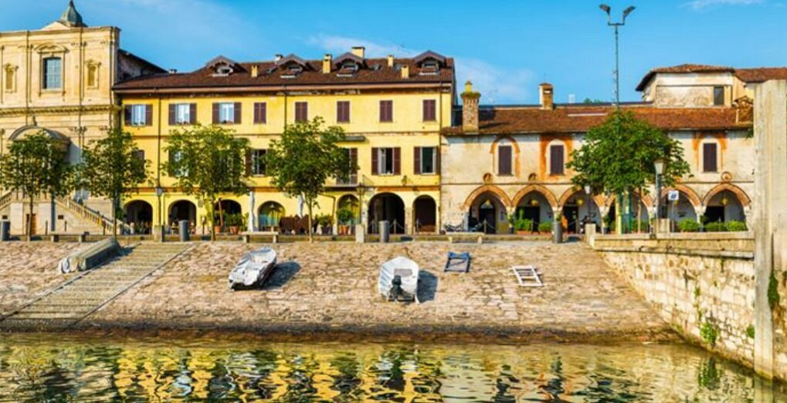

### 🍊 Excursiones desde Baveno.

Hay uno par de sitios con poco turismo, muy poco conocidos, y espectaculares, que se pueden visitar desde Baveno.

* Al lado está el Lago de orta. Hay una localidad en la costa llamada San Giulio 📍[Posición](https://maps.app.goo.gl/EXdm2bYC5681aQ95A) muy bonita, que merec la pena de recorrer paseando, tomar algo en una trattoria, y despues coger una barca hasta la Isola San Giulio, donde hay una abdía benedictina. Sin coches, peatonal, una delicia, rodeada de montañas y el azul oscuro del lago de Orta.

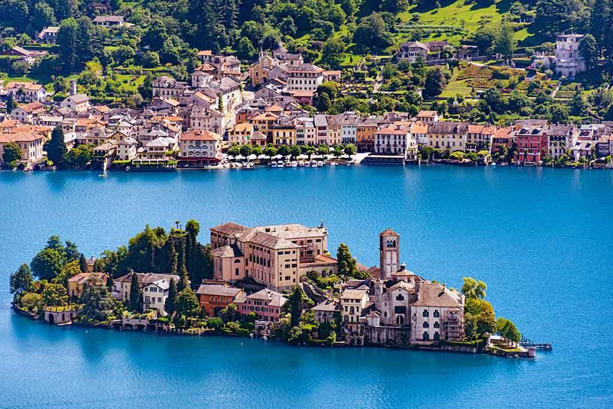

* La otra está un poco más lejos, pero es una excursión de una mañana. Subida a la **Cascada del Toce** en el valle de Formazza. Desde Baveno es una hora y media, 80 Km, 🚗[esta es la ruta](https://maps.app.goo.gl/mAq7AUmaVmH338LH7). El agua cae desde una altura de 150 metros entre montañas. Hay un mirador justo desde donde precipita. Tras el edificio amarillo hay una fran llanura entre montalas. sin apenas turismo. En [este restaurante](https://maps.app.goo.gl/rtNpZa7HkSCt2BuCA) hacen una polenta espectacular.

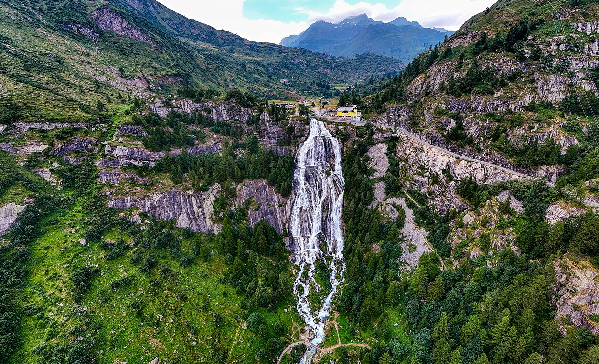

El **valle de Formazza** es maravilloso, y culmina en la *«Cascata del Toce»*. Para acceder a este valle, hay que superar un gran desnivel, y atravesar un túnel. Los túneles no pueden tener una gran pendiente, asñi que se construyó uno de los túneles en espiral más largos que hay en el mundo, y de esta manera salver el gran desnivel al que se encuentra el valle. Fíjate en el trazado.

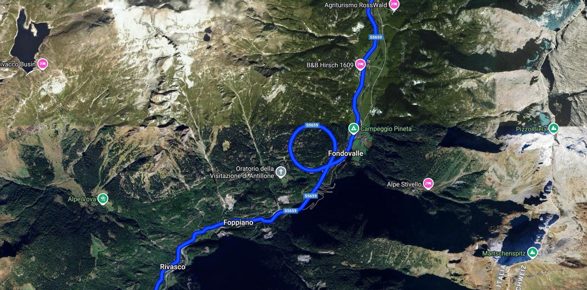

* Una opción más desde Baveno, también alpina, el pueblo de **Macugnaga** 🚗[esta es la ruta](https://maps.app.goo.gl/kZtazNTFZ5obDBA68), que está a solo 60 Km. Desde este pueblo sacado de una postal se ve el Monte Rosa o DufourSpitze para los suizos. Si se llega pronto se puede subir hasta las cumbres en teleférico y bajar andando. Un buen sitio para comer aquí [es este restaurante](https://maps.app.goo.gl/4CFaLwnTSh7KZvRAA)

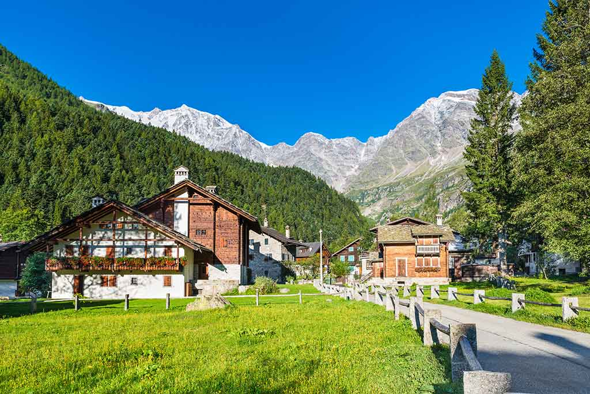

Por último, muy cerca de Baveno hay dos destinos a los que se tarda menos de media hora. Uno es el **lago de Mergozzo**, donde puedes bañarte y comer en el pueblecito que está al lado. La playa está en esta 📍[posición](https://maps.app.goo.gl/J7sVEZKnENTk68Ud9) El pueblo es muy agradable de recorrer, lleno de rincones.

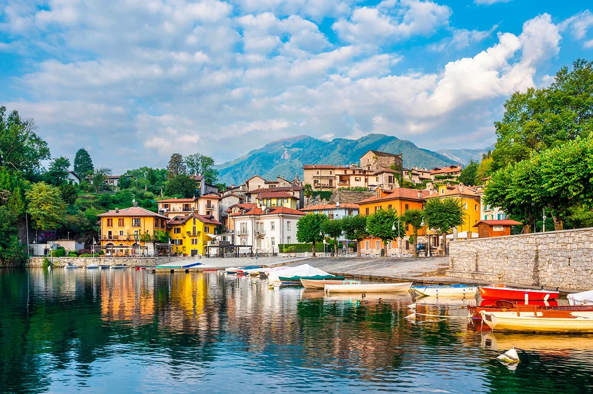

Y para finalizar, una subida al **Mottarone** , desde donde ver todo el lago Maggiore en su inmensidad. Aquí hay una montaña rusa de verano. Alpyland 📍[posición](https://maps.app.goo.gl/EjHKHJLJ1AbA3yEB9) muy divertida. La subida a esta cima era parte de las carreras de rallyes en los años 50. Aquí venían a competir Enzo Ferrrai y compañía. Mira qué vistas.

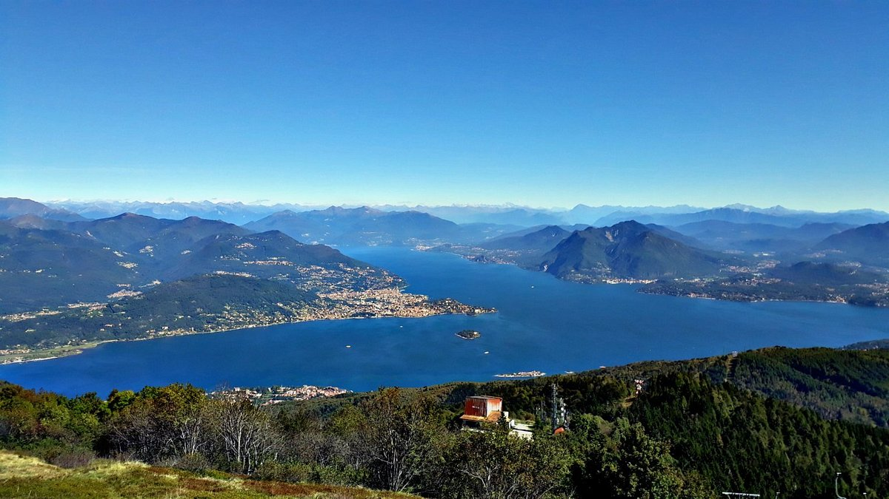

---

## 🥝 Torino

Torino es una ciudad similar a Madrid en cuanto a su trazado y arquitectura. También el clima, sobre todo en invierno, a pesar de tener al lado un río de verdad como el Po que aporta humedad al ambiente. Merece la pena subir a sitios elevados para ver la perspectiva de la ciudad con los Alpes al fondo. Capital del Piamonte, famosa por la Juventus, la FIAT, la Sábana Santa, capital del *Risorgimento* de Italia y por ser la *«ciudad del Diablo»*.

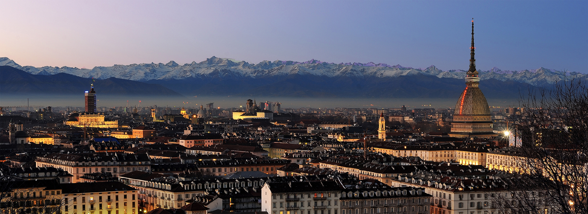

Para dormir os recomiendo el **Hotel Cascina Fossata & Residence**, es barato para lo que es Italia y está muy bien 🔗[Enlace](https://maps.app.goo.gl/ZLRsXTDZMmu6nSW87). Para comer [Bicyclette](https://maps.app.goo.gl/ZwkBYpK9Lwaif74D9), [Pizzium](https://maps.app.goo.gl/ExpUcvkfE7gAM3gg8), [Bar Petit Jardin](https://maps.app.goo.gl/kx96szkxLR6ERJes9)

### 🍊 Palazzo reale

La Piazza Castello es un buen punto de partida para conoi9cer la ciudad. Aquí están el **Palazzo reale**, el **Palazzo Madama** y la **Catedrale di San Giovanni Battista**, que tiene entre sus tesoros la Sindone o Sábana Santa. El Palazzo Madama, que tiene una mezcla de palacio dieciochesco y castillo medieval. Dentro puede haber exposiciones que merecen la entrada. En esta plaza se encuentra el [Bar Baratti](https://maps.app.goo.gl/y2HqnYTbATCE4ySj9), que es muy famoso por su Bicerin, es una bebida tradicional caliente y sin alcohol típica de Turín, evolución de la *bavareisa* del siglo XVIII, sabrosa bebida servida en grandes vasos redondeados, compuesta por una mezcla de café, chocolate y crema de leche endulzada con sirope. Caro pero merece la pena.

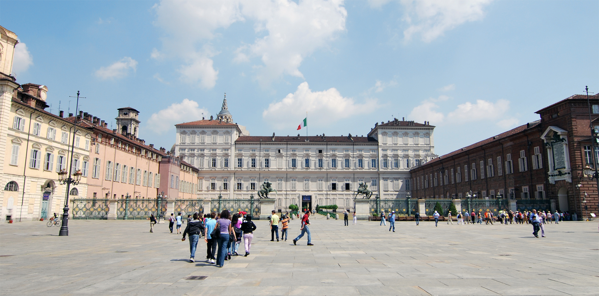

En el Palazzo Reale, además de visitarlo (jardines gratis), a media tarde puede  tomarse la *merienda real*, un ritual que solía celebrarse en la nobleza de Turín y que hoy en día todos pueden experimentar dentro del Palazzo. Café, dulces… merece la pena. S

* Saliendo de la plaza al sur se puede visitar el edificio del primer parlamento italiano, calles comerciales y podemos ir hasta la estación de tren. También muy recomendable el **Museo Egizio**, considerado junto al *British* y el *Louvre* los mejores museos egipcios fuera de El Cairo.
* Si vamos hacia el oeste, también por calles comerciales vamos hasta la Piazza Statutom, con una de las fuentes que algunos identifican con el monumento al diablo, **Monumento al Traforo del Cenisio-Frejus**. Por aquí también se encuentra la **Porta Palazzo**, sueñle haber un mercadillo estilo El rastro madrileño muy interesante de visitar.
* Si salimos al este, podemos pasar a ver y subir a la **Mole Antoneliana** y bajar hasta el Po. Cruzando el punte, la **Gran Madre de Dio**, una iglesia que según la tradición está vigilante de la sonbra del diablo.

Desde este punto se puede:

* Subir a la **Chiesa di Santa Maria del Monte del Cappuccini**, con unas vistas estupendas (se puede aparcar arriba, pero hay poco sitio. Mejor al atarceder). Hay [un 🍽️ restaurante](https://maps.app.goo.gl/nvmZTVQZym4rdGgp6) muy recomendado.
* Volver a la otra orilla del Po y bajar paseando por la riviera entre parques hasta el **Borgo Medievale**, un castillo del XIX imitación medieval muy agradable para ver alguna exposición , comprar recuerdos (aquí hay mercadillo siempre).

### 🍊 Visitas alrededor

Hay dos sitios recomendables.

* Subir en funicular a la **Basílica de Superga**. Se llega en coche, se sube en funicular y se baja paseando. Es la montaña donde se estrelló el avión con el´qeuipo de fúbol del Gran Torino en 1949. Iglersia y monumento con vistas estupendas.
* Sacra di San Michele. Esta abadía inspiró la novela de **El Nombre de la Rosa**. Quita el hipo.

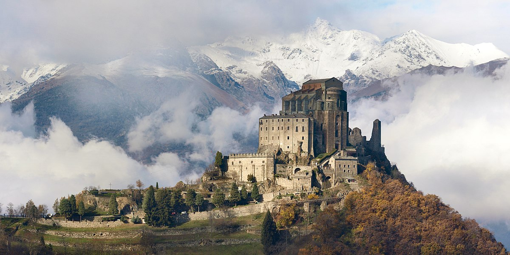

* **Edificio Lingotto**. Aunque sea en coche y de paso, yo me acercaría. Fue en su época una enorme fábrica de coches, construida por Fiat. Fue, en su día, la mayor fábrica de automóviles del mundo. En el techo, a varios pisos de altura tiene el circuito de pruebas tiene 2,4 km de largo y 24 metros de ancho, con dos curvas de 180° extremadamente peraltadas y con superficie de hormigón. Hay un museo de coches con la historia del automovilismo.

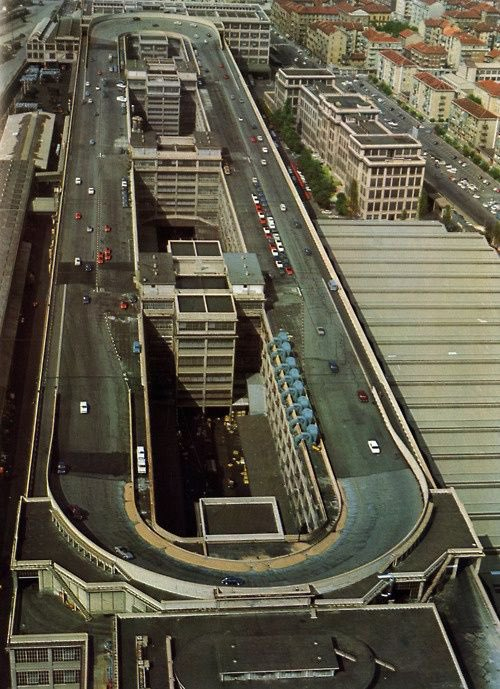
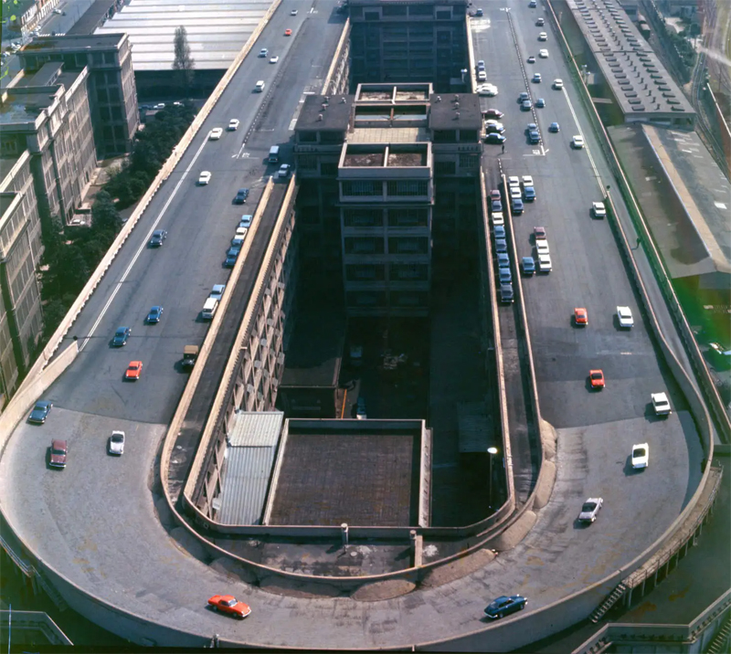

---

## 🥝 El retorno

Desde Torino, podéis volver bajando hasta **Ventimigglia** y volver por la Costa Azul, pasando por Marsella, Niza hasta Arlés, donde coincide con el otro camino que od explico después. Mónaco está sobrevalorado, aunque reconozco que siempre me han quedado ganas de hacer el recorrido de la F1 en coche.

Otra opción es volver por **Grenoble**, atravesando los Alpes por el túnel de Frejus. 🚗[Esta es la ruta](https://maps.app.goo.gl/daJR18dAALT6331L6). El peaje es un buen palo, pero el ahorro en gasolina creo que puede compensar. Así además podéis ver **Chamonix-Mont-Blanc** o **Annecy**, si no lo habéis visto a la ida. Salvo que os interese visitar Niza o Mónaco, yo volvería por aquí. Desde Grenoble, bajais hasta Arles, donde si os dan los días pasaría porque es muy bonita.

## 🥝 Arlés

Más desconocida que Nimes o Niza, y para mi muy bonita. TeiTenían unas *Arènes*, un circo muy buen conservado, y es la ciudad en la que **Van Gogh** se inspiró para muchos de sus cuadros. Hay que perderse por su centro ciudad. Un buen sitio para aparcar 📍[es esta zona](https://maps.app.goo.gl/XFDKs9BqjFVvV56Q9) hay un parking, aunque en la calle hay m,uchos aparcamiento en batería. Desde aquí el centro es un paseo.

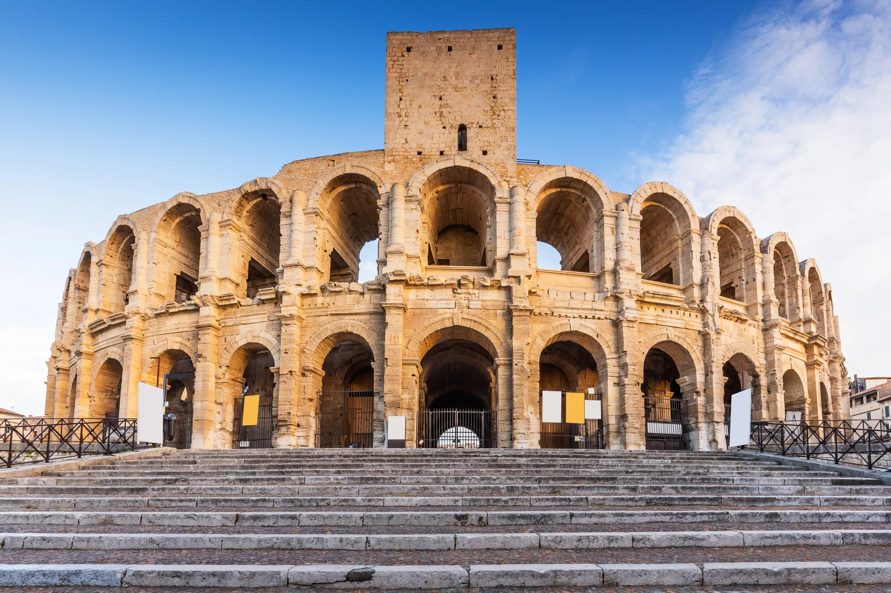

Tras ver **Arles**, si os cuadra dormir cerca, [en este hotel](https://maps.app.goo.gl/2cNPXSD82u1jJGBr5) tenéis incluida la piscina, y está muy bien de precio.

Y de ahí, de vuelta a .<BeautyTag color="#ff5753">España</BeautyTag>
